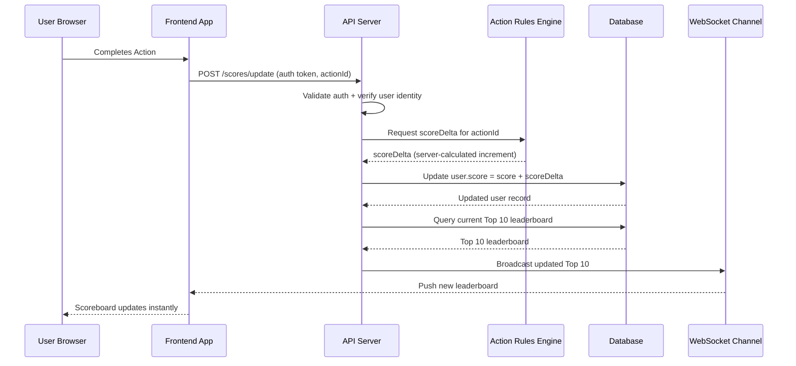

# Problem 5: Architecture

## Task

Write the specification for a software module on the API service (backend application server).

1. Create a documentation for this module on a `README.md` file.
2. Create a diagram to illustrate the flow of execution.
3. Add additional comments for improvement you may have in the documentation.
4. Your specification will be given to a backend engineering team to implement.

## Software Requirements

1. We have a website with a score board, which shows the top 10 user’s scores.
2. We want live update of the score board.
3. User can do an action (which we do not need to care what the action is), completing this action will increase the user’s score.
4. Upon completion the action will dispatch an API call to the application server to update the score.
5. We want to prevent malicious users from increasing scores without authorisation.

---

## Summary

This module provides backend support for a **real-time scoreboard**. It exposes secure APIs for updating user scores when users complete actions. It maintains and serves the **Top 10 leaderboard**, and broadcasts updates to all connected clients in real time. All score updates must be authenticated to prevent tampering. The backend **must never trust the client** for score values or increment amounts.

## Architecture

* The module exposes REST APIs for:
  * Updating user scores
  * Retrieving top 10 scores
* Real-time updates are pushed via:
  * WebSockets (preferred) or SSE
* The scoreboard is maintained using:
  * Primary DB (PostgreSQL or similar)
  * Optional Redis cache for leaderboard performance
* Backend instances synchronize leaderboard updates via:
  * Redis Pub/Sub (or equivalent)
* The server validates all score update requests using:
  * JWT access tokens
  * Server-side action verification (when applicable)
  * Rate limiting / anti-abuse filters

### Server-Determined Score Increments Using Action-Weighted Model

* Each action type has a server-side configured `score_value`.
* API receives only `actionId` or `actionType`.
* Backend fetches score weight from internal config or DB.

**Prohibited**:
Client supplying score, delta, increment, or any numeric value related to score.

### Diagram — Flow of Execution



### Schema

### `users` Table

| Column     | Type            | Notes                  |
| ---------- | --------------- | ---------------------- |
| user_id    | `PK` UUID / INT | User identifier        |
| username   | VARCHAR         | Display name           |
| score      | INT             | Cumulative score       |
| created_at | TIMESTAMP       | For sorting / audits   |
| updated_at | TIMESTAMP       | For sorting / audits   |

### `actions` Table (Optional but recommended)

| Column      | Type            | Notes                                    |
| ----------- | --------------- | ---------------------------------------- |
| action_id   | `PK` UUID / INT | Action identifier                        |
| user_id     | `FK` to users   |                                          |
| action_type | VARCHAR         | For fraud detection / analytics          |
| created_at  | TIMESTAMP       | For sorting / audits                     |
| updated_at  | TIMESTAMP       | For sorting / audits / replay prevention |

### Additional Indexes

* `users.score` (DESC) for leaderboard queries
* `actions.user_id` + `actions.action_type` for audit trail
* Optional unique constraint: `(user_id, action_id)` for preventing replay

## API Contract (OpenAPI-Compatible)

### `GET /scores/top`

**Description:** Returns the top 10 highest scoring users
**Auth:** Public

Response 200

```json
{
  "scores": [
    { "userId": "user1", "username": "Alice", "score": 120 },
    { "userId": "user2", "username": "Bob", "score": 110 }
  ]
}
```

### `POST /scores/update`

**Description:** Updates the user’s score based on a completed action. The server determines score increments.
**Auth:** Required (JWT)
**Notes:**

* Client does **not** send score or increment.
* Auth token required via header (`Authorization: Bearer <jwt>`).
* `actionId` must be validated against known server-side actions.

Request Body

```json
{
  "actionId": "action1"
}
```

**Server Behavior:**

1. Validate token and user identity.
2. Check that `actionId` is valid, not expired, and not replayed.
3. Fetch score increment from:
   * fixed server constant,
   * server DB lookup, or
   * event-sourcing system.
4. Apply increment.
5. Recompute or update leaderboard cache.
6. Publish WebSocket event `LEADERBOARD_UPDATED`.

Response 200

```json
{
  "message": "Score updated",
  "newScore": 121
}
```

Response 403

```json
{
  "error": "Unauthorized score update"
}
```

### Request `GET /scores/subscribe` (WebSocket or SSE)

**Description:** Subscribes the client to live leaderboard updates
**Auth:** Optional (depends on product requirements)

## Requirements

### Business Requirements

* [ ] Maintain a real-time Top 10 scoreboard.
* [ ] Score increments must always be authorized.
* [ ] Only genuine user actions should trigger a score increase.
* [ ] System must prevent fraudulent score manipulation.

### Technical Requirements

* [ ] API must expose secure, authenticated endpoints for score updates.
* [ ] Server must determine score increments; client must never send points.
* [ ] JWT required for `/scores/update`.
* [ ] Rate limiting required on `/scores/update`.
* [ ] Optional replay protection using `actionId`.
* [ ] Atomic DB operations to avoid race conditions.
* [ ] Leaderboard sorted by descending score.
* [ ] Leaderboard recalculated or refreshed after every valid update.
* [ ] Leaderboard must broadcast to all connected WebSocket/SSE clients.
* [ ] Redis cache for leaderboard (1–2s TTL recommended).
* [ ] Horizontal scalability via Redis Pub/Sub or event bus.
* [ ] System logs all score updates (userId, increment, timestamp).
* [ ] Strict validation of action ownership and permission.

### Non-Technical Requirements

* [ ] System must gracefully handle high traffic.
* [ ] Observability: structured logs, metrics, and error tracking.
* [ ] System must remain responsive during rapid score updates.
* [ ] Deployment must support zero-downtime updates.

## Out of Scope

* ❌ Implementation of the user action itself
* ❌ Frontend UI for leaderboard
* ❌ Gamification logic unrelated to score counting
* ❌ Admin panel for editing scores

## Dependencies

* Node.js, TypeScript
* Nest.js or Express.js
* PostgreSQL (or similar relational DB)
* Redis (cache + pub/sub)
* WebSocket/SSE library
* JWT authentication provider
* API Gateway / Load Balancer

## Acceptance Criteria

* [ ] Valid JWT → score updates successfully.
* [ ] Score increment determined solely by server rules.
* [ ] No client-provided score is accepted.
* [ ] Duplicate `actionId` → update rejected.
* [ ] Unauthorized users → 403.
* [ ] Leaderboard always sorted and returns max 10 users.
* [ ] Leaderboard broadcasts after each valid update.
* [ ] WebSocket/SSE clients reconnect seamlessly.
* [ ] System handles 100+ updates/sec with <1s broadcast delay.
* [ ] Redis cache stays consistent with DB state.
* [ ] Logs contain userId, actionId, delta, and timestamp.

## Test Cases

### Score Update

* [ ] Valid token + valid actionId → score increments correctly.
* [ ] Invalid/missing token → 403.
* [ ] Missing actionId → 400.
* [ ] Replay of actionId → 409.
* [ ] Attempt to send `score` field → reject request.
* [ ] Action not belonging to user → 403.
* [ ] DB error → 500.

### Leaderboard

* [ ] Top 10 returned correctly sorted.
* [ ] Score change causes leaderboard refresh.
* [ ] Users jumping into top 10 handled correctly.
* [ ] Empty leaderboard handled correctly.

### Rate Limiting

* [ ] Excessive requests return 429.

### WebSocket

* [ ] New client receives current leaderboard immediately.
* [ ] Live broadcasts received in correct order.
* [ ] Reconnection restores subscription state.

### Security & Abuse

* [ ] Client cannot alter scoring logic.
* [ ] Malicious burst requests detected and throttled.
* [ ] Replay attacks rejected.
* [ ] Invalid action metadata rejected.

## Edge Cases

* [ ] User score overflow (INT max).
* [ ] Two updates for the same user at the same time (race condition).
* [ ] Leaderboard reorder edge: user jumps from outside top 10 to inside.
* [ ] Empty leaderboard (no users).
* [ ] Network drop during broadcast.
* [ ] Redis unavailable → fallback to DB.
* [ ] Replay attacks using same `actionId`.
* [ ] Extreme score spamming attempts.

## QA

* Functional testing on staging with simulated action bursts.
* Load testing to simulate 100–1000 updates/sec.
* Verify WebSocket scaling through gateway or sticky sessions.
* Chaos testing: kill Redis, verify fallback behavior.
* Validate logs for completeness and traceability.
* Run replay-attack and spam-attack simulations.
